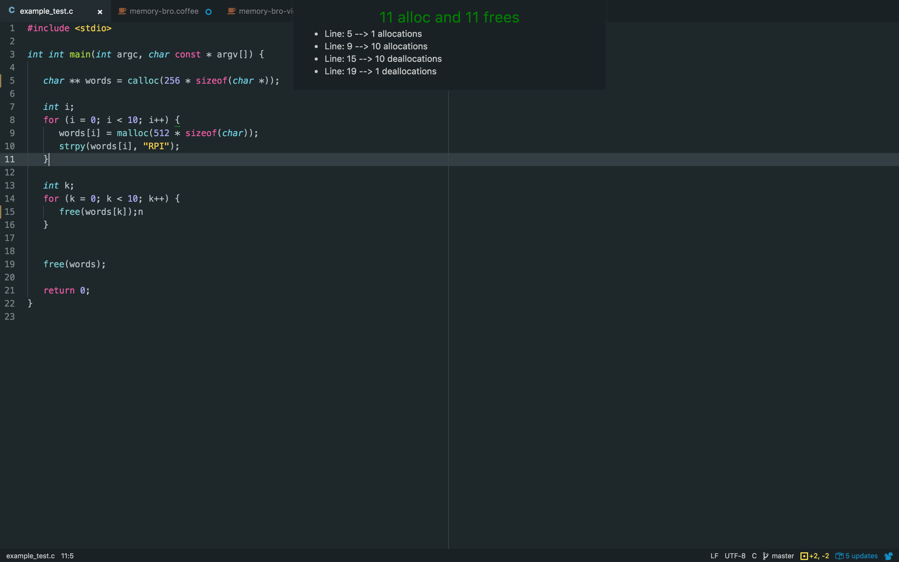
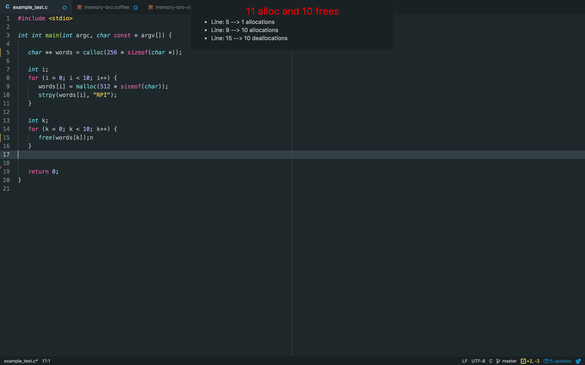

# memory-bro package

## A simple memory leak checker for C.

### Usage
Press ```ctrl + alt + n``` to trigger the package to determine the existence of possible memory leaks in your code. You will be able to see a detailed view that shows how much and on what line memory is being allocated and deallocated. This package is NOT created to replace traditional memory leak checkers like Valgrind. Rather it is made to make quick checks as your write your code.





### Contributers

* [Mukul Surajiwale](https://github.com/mukulio)

* [Ryan Manske](https://github.com/rymanske)

* [Alwin Joy](https://github.com/alwinrobot)

* [Nathan Potolsky](https://github.com/nathanpotolsky)

* [Zhenyu (Victor) Zhu](https://github.com/SLiNv)

# Issues and Todo
- Add support for functions like ```open()```
- Add suppot for ```while``` loops
